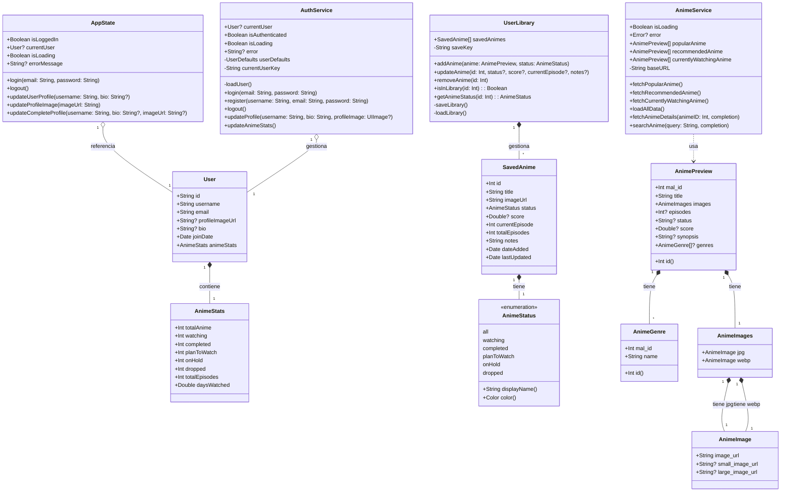

```mermaid
classDiagram
    %% Modelos principales
    class User {
        +String id
        +String username
        +String email
        +String? profileImageUrl
        +String? bio
        +Date joinDate
        +AnimeStats animeStats
    }
    
    class AnimeStats {
        +Int totalAnime
        +Int watching
        +Int completed
        +Int planToWatch
        +Int onHold
        +Int dropped
        +Int totalEpisodes
        +Double daysWatched
    }
    
    class SavedAnime {
        +Int id
        +String title
        +String imageUrl
        +AnimeStatus status
        +Double? score
        +Int currentEpisode
        +Int totalEpisodes
        +String notes
        +Date dateAdded
        +Date lastUpdated
    }
    
    class AnimeStatus {
        <<enumeration>>
        all
        watching
        completed
        planToWatch
        onHold
        dropped
        +String displayName()
        +Color color()
    }
    
    class AnimePreview {
        +Int mal_id
        +String title
        +AnimeImages images
        +Int? episodes
        +String? status
        +Double? score
        +String? synopsis
        +AnimeGenre[]? genres
        +Int id()
    }
    
    class AnimeGenre {
        +Int mal_id
        +String name
        +Int id()
    }
    
    class AnimeImages {
        +AnimeImage jpg
        +AnimeImage webp
    }
    
    class AnimeImage {
        +String image_url
        +String? small_image_url
        +String? large_image_url
    }
    
    %% Servicios
    class AnimeService {
        +Boolean isLoading
        +Error? error
        +AnimePreview[] popularAnime
        +AnimePreview[] recommendedAnime
        +AnimePreview[] currentlyWatchingAnime
        -String baseURL
        +fetchPopularAnime()
        +fetchRecommendedAnime()
        +fetchCurrentlyWatchingAnime()
        +loadAllData()
        +fetchAnimeDetails(animeID: Int, completion)
        +searchAnime(query: String, completion)
    }
    
    class AuthService {
        +User? currentUser
        +Boolean isAuthenticated
        +Boolean isLoading
        +String? error
        -UserDefaults userDefaults
        -String currentUserKey
        -loadUser()
        +login(email: String, password: String)
        +register(username: String, email: String, password: String)
        +logout()
        +updateProfile(username: String, bio: String, profileImage: UIImage?)
        +updateAnimeStats()
    }
    
    class UserLibrary {
        +SavedAnime[] savedAnimes
        -String saveKey
        +addAnime(anime: AnimePreview, status: AnimeStatus)
        +updateAnime(id: Int, status?, score?, currentEpisode?, notes?)
        +removeAnime(id: Int)
        +isInLibrary(id: Int): Boolean
        +getAnimeStatus(id: Int): AnimeStatus
        -saveLibrary()
        -loadLibrary()
    }
    
    class AppState {
        +Boolean isLoggedIn
        +User? currentUser
        +Boolean isLoading
        +String? errorMessage
        +login(email: String, password: String)
        +logout()
        +updateUserProfile(username: String, bio: String?)
        +updateProfileImage(imageUrl: String)
        +updateCompleteProfile(username: String, bio: String?, imageUrl: String?)
    }
    
    %% Relaciones
    User "1" *-- "1" AnimeStats : contiene
    UserLibrary "1" *-- "*" SavedAnime : gestiona
    SavedAnime "1" *-- "1" AnimeStatus : tiene
    AnimePreview "1" *-- "1" AnimeImages : tiene
    AnimePreview "1" *-- "*" AnimeGenre : tiene
    AnimeImages "1" *-- "1" AnimeImage : tiene jpg
    AnimeImages "1" *-- "1" AnimeImage : tiene webp
    AppState "1" o-- "1" User : referencia
    AuthService "1" o-- "1" User : gestiona
    AnimeService ..> AnimePreview : usa
```
