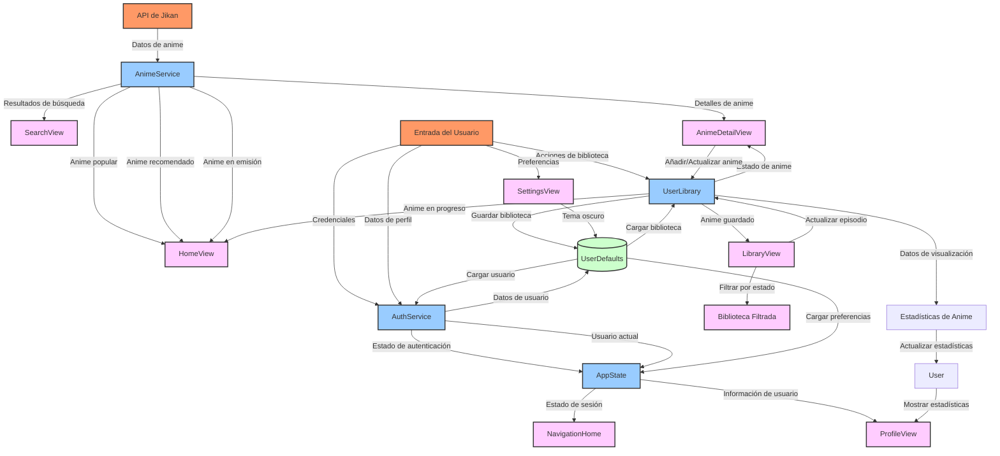

```mermaid
flowchart TD
    %% Fuentes de datos externas
    JikanAPI[API de Jikan] -->|Datos de anime| AnimeService

    %% Servicios
    AnimeService -->|Anime popular| HomeView
    AnimeService -->|Anime recomendado| HomeView
    AnimeService -->|Anime en emisión| HomeView
    AnimeService -->|Resultados de búsqueda| SearchView
    AnimeService -->|Detalles de anime| AnimeDetailView

    %% Autenticación
    UserInput[Entrada del Usuario] -->|Credenciales| AuthService
    AuthService -->|Estado de autenticación| AppState
    AppState -->|Estado de sesión| NavigationHome
    
    %% Gestión de usuario
    UserInput -->|Datos de perfil| AuthService
    AuthService -->|Datos de usuario| UserDefaults[(UserDefaults)]
    UserDefaults -->|Cargar usuario| AuthService
    AuthService -->|Usuario actual| AppState
    AppState -->|Información de usuario| ProfileView
    
    %% Biblioteca de usuario
    UserInput -->|Acciones de biblioteca| UserLibrary
    UserLibrary -->|Guardar biblioteca| UserDefaults
    UserDefaults -->|Cargar biblioteca| UserLibrary
    UserLibrary -->|Anime guardado| LibraryView
    UserLibrary -->|Estado de anime| AnimeDetailView
    UserLibrary -->|Anime en progreso| HomeView
    
    %% Interacciones con anime
    AnimeDetailView -->|Añadir/Actualizar anime| UserLibrary
    LibraryView -->|Filtrar por estado| FilteredLibrary[Biblioteca Filtrada]
    LibraryView -->|Actualizar episodio| UserLibrary
    
    %% Estadísticas
    UserLibrary -->|Datos de visualización| AnimeStats[Estadísticas de Anime]
    AnimeStats -->|Actualizar estadísticas| User
    User -->|Mostrar estadísticas| ProfileView
    
    %% Configuración
    UserInput -->|Preferencias| SettingsView
    SettingsView -->|Tema oscuro| UserDefaults
    UserDefaults -->|Cargar preferencias| AppState
    
    %% Leyenda
    classDef external fill:#f96,stroke:#333,stroke-width:2px
    classDef service fill:#9cf,stroke:#333,stroke-width:2px
    classDef view fill:#fcf,stroke:#333,stroke-width:2px
    classDef storage fill:#cfc,stroke:#333,stroke-width:2px
    
    class JikanAPI,UserInput external
    class AnimeService,AuthService,UserLibrary,AppState service
    class HomeView,SearchView,AnimeDetailView,LibraryView,ProfileView,SettingsView,NavigationHome,FilteredLibrary view
    class UserDefaults storage
```
