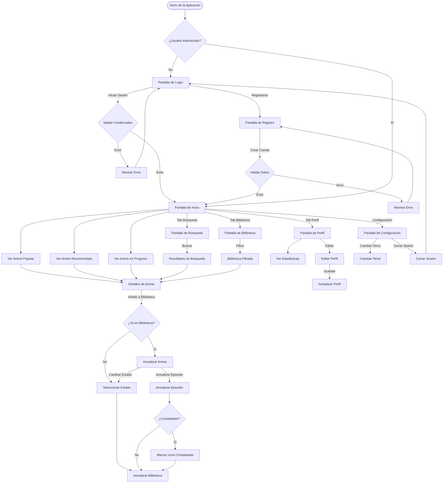

```mermaid
flowchart TD
    Start([Inicio de la Aplicación]) --> Auth{¿Usuario Autenticado?}
    
    %% Flujo de Autenticación
    Auth -->|No| Login[Pantalla de Login]
    Login -->|Iniciar Sesión| ValidateLogin{Validar Credenciales}
    ValidateLogin -->|Éxito| Home
    ValidateLogin -->|Error| LoginError[Mostrar Error]
    LoginError --> Login
    
    Login -->|Registrarse| Register[Pantalla de Registro]
    Register -->|Crear Cuenta| ValidateRegister{Validar Datos}
    ValidateRegister -->|Éxito| Home
    ValidateRegister -->|Error| RegisterError[Mostrar Error]
    RegisterError --> Register
    
    %% Flujo Principal
    Auth -->|Sí| Home[Pantalla de Inicio]
    
    %% Navegación Principal
    Home --> PopularAnime[Ver Anime Popular]
    Home --> RecommendedAnime[Ver Anime Recomendado]
    Home --> CurrentlyWatching[Ver Anime en Progreso]
    
    PopularAnime --> AnimeDetail[Detalles de Anime]
    RecommendedAnime --> AnimeDetail
    CurrentlyWatching --> AnimeDetail
    
    %% Flujo de Búsqueda
    Home -->|Tab Búsqueda| Search[Pantalla de Búsqueda]
    Search -->|Buscar| SearchResults[Resultados de Búsqueda]
    SearchResults --> AnimeDetail
    
    %% Flujo de Biblioteca
    Home -->|Tab Biblioteca| Library[Pantalla de Biblioteca]
    Library -->|Filtrar| FilteredLibrary[Biblioteca Filtrada]
    FilteredLibrary --> AnimeDetail
    
    %% Interacciones con Anime
    AnimeDetail -->|Añadir a Biblioteca| AddToLibrary{¿Ya en Biblioteca?}
    AddToLibrary -->|No| SelectStatus[Seleccionar Estado]
    SelectStatus --> UpdateLibrary[Actualizar Biblioteca]
    AddToLibrary -->|Sí| UpdateAnime[Actualizar Anime]
    
    UpdateAnime -->|Cambiar Estado| SelectStatus
    UpdateAnime -->|Actualizar Episodio| UpdateEpisode[Actualizar Episodio]
    UpdateEpisode --> CheckComplete{¿Completado?}
    CheckComplete -->|Sí| MarkComplete[Marcar como Completado]
    CheckComplete -->|No| UpdateLibrary
    MarkComplete --> UpdateLibrary
    
    %% Flujo de Perfil
    Home -->|Tab Perfil| Profile[Pantalla de Perfil]
    Profile --> ViewStats[Ver Estadísticas]
    Profile -->|Editar| EditProfile[Editar Perfil]
    EditProfile -->|Guardar| UpdateProfile[Actualizar Perfil]
    
    %% Configuración
    Home -->|Configuración| Settings[Pantalla de Configuración]
    Settings -->|Cambiar Tema| ToggleTheme[Cambiar Tema]
    Settings -->|Cerrar Sesión| Logout[Cerrar Sesión]
    Logout --> Login
```
