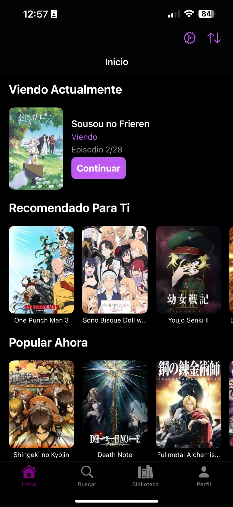
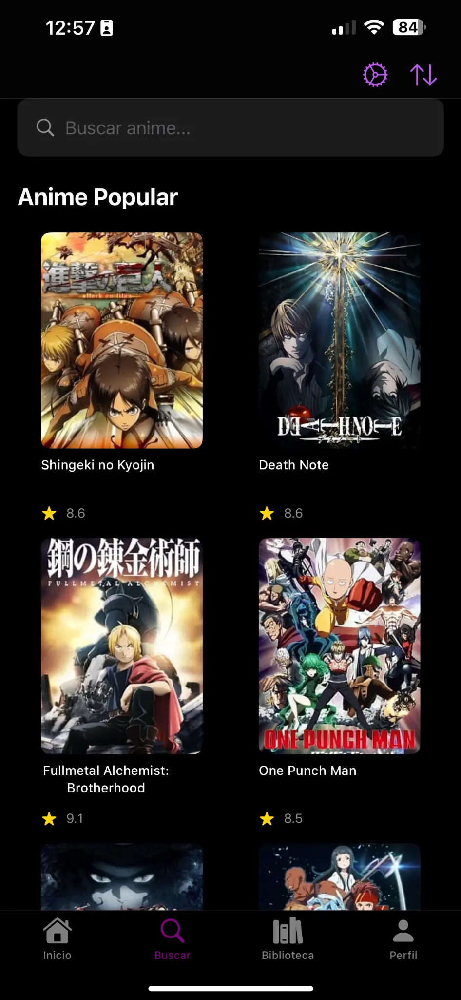
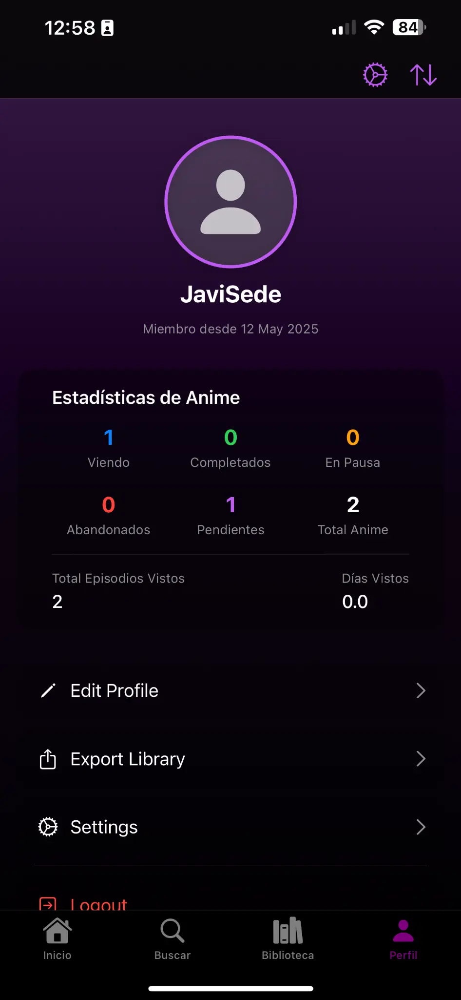

# 🎌 AnimeTracker: Tu compañero para seguir tus animes favoritos

<!-- Aquí irá el logo generado -->
<p align="center">
  
</p>

AnimeTracker es una aplicación para iOS, desarrollada en Swift, que te permite llevar un control exhaustivo de todas tus series de anime. Con esta herramienta, podrás organizar fácilmente los animes que estás viendo actualmente, aquellos que ya has completado y los que tienes en tu lista de pendientes para ver en el futuro. Su interfaz, moderna e intuitiva, junto con funcionalidades pensadas específicamente para la comunidad otaku, transforman el seguimiento de tu progreso en una experiencia sencilla y estéticamente agradable.

<p align="center">
  
  
  
  
  
  
  
  
</p>

## ✨ Características Destacadas

AnimeTracker se enfoca en proporcionar una experiencia de usuario fluida y completa. Podrás gestionar tu **biblioteca personal de animes**, organizándolos en listas personalizadas como "Viendo", "Completado", "En espera" o "Abandonado". Además, la aplicación facilita el **seguimiento detallado de episodios**, permitiéndote marcar los que ya has visto y visualizar tu avance mediante estadísticas claras y motivadoras. Para mantener tu información segura, AnimeTracker implementa un sistema de **autenticación robusto**, con inicio de sesión y registro protegidos mediante Keychain y almacenamiento seguro de credenciales. Todo esto se complementa con un **perfil de usuario personalizado**, desde donde podrás visualizar tu progreso, editar tu información y gestionar tu biblioteca de forma centralizada. La interfaz, diseñada con SwiftUI, es **intuitiva y moderna**, ofreciendo una experiencia visual minimalista y agradable.

## 🖼️ Capturas de Pantalla

<p align="center">
  
  <br/><em>Pantalla de Inicio</em><br/><br/>
  
  <br/><em>Pantalla de Búsqueda</em><br/><br/>
  
  <br/><em>Pantalla de Biblioteca</em><br/><br/>
  
  <br/><em>Pantalla de Perfil</em><br/>
</p>

## 🛠️ Tecnologías Utilizadas

El desarrollo de AnimeTracker se apoya en un conjunto de tecnologías modernas y eficientes, seleccionadas para ofrecer el mejor rendimiento y experiencia en la plataforma iOS. El lenguaje principal de desarrollo es **Swift**, aprovechando su seguridad y velocidad. La interfaz de usuario está construida enteramente con **SwiftUI**, lo que permite un diseño declarativo, moderno y adaptable. Para la persistencia de datos, se utiliza **SwiftData**, el framework más reciente de Apple para la gestión de datos en aplicaciones Swift. La seguridad es un pilar fundamental, por lo que se emplean **Keychain** para el almacenamiento seguro de credenciales y **CryptoKit** para operaciones criptográficas como el hashing de contraseñas. La arquitectura de la aplicación sigue el patrón **MVVM (Modelo-Vista-VistaModelo)**, complementado con una capa de Servicios para desacoplar la lógica de negocio y mejorar la mantenibilidad y escalabilidad del código.

## 🗺️ Roadmap del Proyecto

AnimeTracker es un proyecto en continuo desarrollo con el objetivo de ofrecer cada vez más funcionalidades útiles para los aficionados al anime. Actualmente, nos encontramos trabajando en varias mejoras y nuevas características. Una de las prioridades es la **integración con APIs de anime externas**, lo que permitirá a los usuarios descubrir nuevas series, obtener información detallada (sinopsis, géneros, estudios, fechas de emisión) y sincronizar datos directamente desde la aplicación. También planeamos mejorar las **opciones de personalización del perfil** y las estadísticas de visualización. A largo plazo, exploraremos la posibilidad de añadir funcionalidades sociales, como la opción de compartir listas o recomendaciones con amigos. ¡Mantente atento a las próximas actualizaciones!

## 📂 Estructura del Proyecto

La organización del código fuente de AnimeTracker está diseñada para ser clara y facilitar tanto el mantenimiento como la colaboración. A continuación, se describe la estructura principal de directorios y su propósito:

```plaintext
AnimeTracker/
├── AnimeTrackerApp.swift        # Punto de entrada de la aplicación y configuración inicial.
├── Assets.xcassets/             # Contiene todos los recursos gráficos (iconos, imágenes, colores).
├── ContentView.swift            # Vista principal o contenedor inicial de la interfaz de usuario.
├── Diagramas/                   # Diagramas UML u otros documentos visuales de diseño.
├── model/                       # Definiciones de los modelos de datos (Entidades de SwiftData).
├── service/                     # Lógica de negocio y servicios (ej. autenticación, API).
│   └── auth/                    # Módulo específico para la autenticación de usuarios.
└── view/                        # Componentes de la interfaz de usuario construidos con SwiftUI.
    └── auth/                    # Vistas relacionadas con el login y el registro de usuarios.
```

Esta estructura modular ayuda a mantener el código organizado y facilita la comprensión del flujo de datos y responsabilidades dentro de la aplicación.

## 🚀 Cómo Ejecutar el Proyecto

Para poner en marcha AnimeTracker en tu entorno de desarrollo local, necesitarás seguir unos sencillos pasos. Primero, asegúrate de tener Xcode instalado y actualizado en tu Mac. Luego, clona este repositorio en tu máquina local utilizando el siguiente comando en tu terminal:

```bash
cd ruta/a/tu/directorio/de/proyectos
git clone https://github.com/tu-usuario/AnimeTracker.git
```

Una vez clonado el repositorio, navega hasta la carpeta del proyecto:

```bash
cd AnimeTracker
```

Abre el archivo `AnimeTracker.xcodeproj` (o el archivo `.xcworkspace` si el proyecto utiliza CocoaPods o Swift Package Manager para dependencias externas) con Xcode. Dentro de Xcode, selecciona un simulador de iOS o conecta un dispositivo físico compatible. Finalmente, haz clic en el botón ▶️ (Build and Run) en la barra de herramientas de Xcode. Esto compilará el proyecto y ejecutará la aplicación AnimeTracker en el dispositivo o simulador seleccionado, permitiéndote verla en acción.

## 🔐 Seguridad y Autenticación

La protección de la información del usuario es una prioridad en AnimeTracker. Para ello, se han implementado varias medidas de seguridad. Las contraseñas de los usuarios se manejan de forma segura mediante el uso de **CryptoKit**, aplicando un hash SHA256 junto con un "salt" único para cada contraseña antes de su almacenamiento, lo que previene ataques de diccionario o tablas precalculadas. Las credenciales de acceso, una vez verificadas, se almacenan de forma segura en el **Keychain** del dispositivo, un almacén cifrado proporcionado por iOS para datos sensibles. La gestión de la sesión y el proceso de autenticación están encapsulados y desacoplados del resto de la aplicación a través de un `AuthService` y un `AuthRepository`, lo que centraliza la lógica de seguridad y facilita su mantenimiento y auditoría. Toda la lógica relacionada con la autenticación y la seguridad de las credenciales se encuentra organizada dentro de la carpeta `service/auth/` del proyecto, siendo el archivo `KeychainManager.swift` una pieza clave en la interacción con el Keychain.

## 🤝 Contribuciones

¡Tu colaboración es muy valiosa para hacer de AnimeTracker una aplicación aún mejor! Si tienes ideas, encuentras errores o quieres añadir nuevas funcionalidades, te animamos a contribuir. El proceso es sencillo: primero, realiza un "fork" de este repositorio a tu propia cuenta de GitHub. Luego, crea una nueva rama en tu fork para trabajar en tus cambios; es recomendable usar un nombre descriptivo para la rama, por ejemplo:

```bash
git checkout -b feature/nombre-de-tu-funcionalidad
```

Realiza todas las modificaciones y mejoras que consideres necesarias en tu rama. Una vez que estés satisfecho con tus cambios, haz "commit" de ellos con un mensaje claro que describa lo que has hecho:

```bash
git commit -m "Agrega [descripción de la nueva funcionalidad o arreglo]"
```

Sube tu rama a tu repositorio en GitHub:

```bash
git push origin feature/nombre-de-tu-funcionalidad
```

Finalmente, abre un "Pull Request" desde tu rama hacia la rama principal (`main` o `develop`) del repositorio original. En la descripción del Pull Request, detalla los cambios que has realizado y por qué son importantes. Revisaremos tu contribución lo antes posible.

## 💖 Apoya el Proyecto

Si AnimeTracker te resulta útil, disfrutas usándolo o simplemente te gusta la idea detrás del proyecto, ¡considera apoyar su desarrollo! Tu apoyo nos ayuda a dedicar más tiempo y recursos para mejorar la aplicación, añadir nuevas características y mantenerla actualizada. Aunque actualmente no tenemos un sistema de donaciones directas integrado, puedes mostrar tu apoyo de las siguientes maneras:

*   **Deja una estrella ⭐ en el repositorio:** Es una forma sencilla y rápida de mostrar tu aprecio y ayuda a dar visibilidad al proyecto.
*   **Comparte el proyecto:** Habla de AnimeTracker con tus amigos, en redes sociales o en comunidades de anime. Cuanta más gente lo conozca, mejor.
*   **Contribuye con código o ideas:** Como se mencionó en la sección anterior, tus contribuciones son muy bienvenidas.

Si te gusta AnimeTracker y quieres apoyar su desarrollo, ¡puedes invitarme a un café en Ko-fi!

[](https://ko-fi.com/javisede07) 

## 📜 Licencia

Este proyecto se distribuye bajo la Licencia MIT. Puedes encontrar una copia completa de la licencia en el archivo `LICENSE` del repositorio. En resumen, eres libre de usar, copiar, modificar, fusionar, publicar, distribuir, sublicenciar y/o vender copias del software, siempre y cuando incluyas el aviso de copyright y el aviso de permiso en todas las copias o porciones sustanciales del software.

